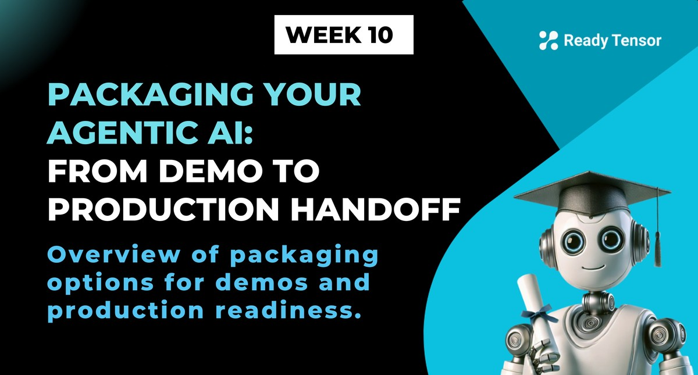
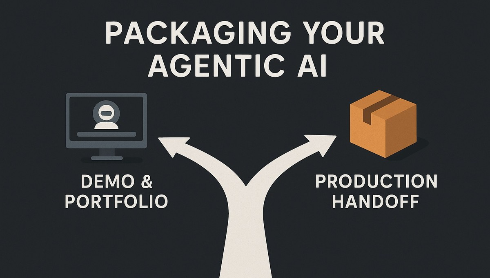

--DIVIDER--

# TLDR

This lesson previews your options for packaging agentic AI systems: demo showcases for portfolios or production handoffs for enterprise teams.

---

--DIVIDER--

You've built a powerful agentic AI system. You've tested it for safety and reliability. Now comes the crucial question: **What's next?**

This week explores **two distinct paths** for your agentic AI system — each serving different goals and audiences.

The path you choose depends on your context, but the principles remain the same: **package your work professionally** so others can understand, use, and build upon it.

--DIVIDER--

# Two paths forward

Your agentic AI system is ready to leave the development environment. But where it goes next depends on your goals:

--DIVIDER--

--DIVIDER--

## Path 1: Demo & Portfolio Path (Hobby/Student Projects)

Build shareable demos that showcase your expertise to collaborators and employers:

- **Quick visual interfaces** using Gradio and Streamlit
- **Easy hosting** on Hugging Face Spaces and Streamlit Cloud
- **Portfolio-ready showcases** that demonstrate real capabilities
- **API services** for others who want to integrate with your work

Perfect for: Job interviews, portfolio projects, academic presentations, and proof-of-concept demonstrations.

## Path 2: Production Handoff Path (Enterprise Implementation)

Prepare your system for professional DevOps teams and real-world deployment:

- **Resilience engineering** — Handle failures gracefully when stakes are high
- **Comprehensive documentation** — Technical specs, model documentation, and compliance materials
- **Professional packaging** — Everything DevOps needs for enterprise deployment

Perfect for: Enterprise implementations, regulated industries, and professional development workflows.

---

--DIVIDER--

# What's in store this week?

This week takes you through both paths — from demo creation to professional handoff.

**Path 1: Demo & Portfolio Focus**

- **Lessons 1a-1b**: **FastAPI & Render** — Build professional APIs and deploy them as scalable services
- **Lesson 2**: **Gradio & Hugging Face** — Create intuitive demos and share them instantly
- **Lesson 3**: **Streamlit & Cloud** — Build interactive showcases for stakeholders and employers

**Path 2: Production Handoff Focus**

- **Lesson 4**: **Building Resilience** — Handle real-world failures: What happens when OpenAI or Tavily goes down?
- **Lesson 5**: **Production Documentation** — Technical docs, model docs, and compliance materials for professional handoffs

_Note: FastAPI (Lesson 1) can serve both paths — demos and production APIs._

By the end of this week, you'll have:

- **Demo-ready showcases** that impress employers and collaborators
- **Production-ready packages** that DevOps teams can actually work with
- **Professional documentation** that meets technical and business requirements
- **Resilient systems** that handle real-world failures gracefully

Your agentic AI system is no longer just working code.

It's a **professionally packaged solution** ready for its next chapter, whether that's landing you a job or powering enterprise applications.

---
