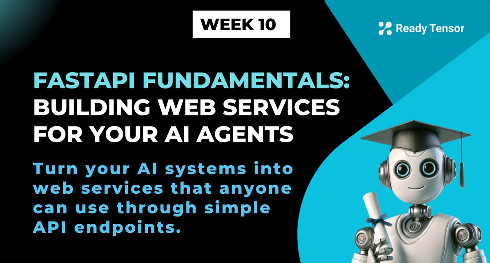

--DIVIDER--

---

[🏠 Home - All Lessons](https://app.readytensor.ai/hubs/ready_tensor_certifications)

[⬅️ Previous - Week 10 Preview](https://app.readytensor.ai/publications/cPsF3K8r69bd)
[➡️ Next - App Deployment on Render](https://app.readytensor.ai/publications/i3gMkNkTokWR)

---

# TL;DR

In this lesson, you'll learn how to turn your AI systems—whether a simple chatbot or a full RAG pipeline—into web-accessible services using FastAPI. You'll walk through two real examples: a basic LangChain+Groq chatbot, and a research assistant powered by retrieval-augmented generation. You'll learn how to expose clean API endpoints, test your app locally, generate docs automatically, and prepare your agentic system for cloud deployment.

---

--DIVIDER--

# Making Your Agent Available: The API Pathway

Your agentic system works—you've tested it, refined its behavior, and maybe even built a multi-agent team. But it still only works **on your machine**.

So how do you let someone else use it?

That's where **deployment interfaces** come in. You need a way for others—users, apps, teammates, or even other agents—to send input and receive intelligent responses.

You have a few options:

- Build a **demo interface** with Gradio or Streamlit (coming up in later lessons)
- Expose your system through an **MCP server** for agent-to-agent collaboration
- Or go with the most common approach: **build a REST API**, the universal standard for web-based system communication

**Think of a REST API as your agent's public-facing "door." Anyone with the key (i.e. a properly formatted request) can knock and get a smart response, without needing to know how the internals work.**

You **could** also use lower-level options like **gRPC**, which is faster and used in high-performance systems. But REST remains the most **accessible, flexible, and interoperable** approach, especially for web-facing agents.

In this lesson, you'll wrap your agent in a FastAPI application, a lightweight, Pythonic framework for building robust REST APIs. It's what we use at Ready Tensor to get agentic systems into the hands of real users, fast.

---

--DIVIDER--

# What Are REST APIs?

REST APIs (Representational State Transfer APIs) are how software systems talk to each other over the web using standard HTTP methods like GET, POST, PUT, and DELETE. They act as structured messengers between clients (apps or frontends) and backends (like your agentic AI system).

## The Restaurant Analogy

Think of a REST API like a restaurant service system:

- **You (the customer)** are the client (user or application)
- **The waiter** is the API
- **The kitchen** is your AI system/server
- **The chef** is your AI agent processing the request
- **The meal** is the intelligent response

You don't go into the kitchen and start talking directly to the chef. Instead, you tell the waiter what you want, the waiter takes your order to the kitchen, the chef (your agent) prepares your response, and the waiter brings it back to you.

In our case, users send requests (questions or prompts) to your API endpoint, the API forwards them to your agentic system, your agent processes them intelligently, and the API returns the response in a standard format everyone understands—usually JSON.

This makes REST APIs perfect for connecting frontend interfaces, integrating with third-party services, enabling automated workflows, and letting other developers use your system safely and predictably.

---

--DIVIDER--

# Why FastAPI? Your Agent's Web Interface

--DIVIDER--


--DIVIDER--

So we've decided on building a REST API. But **how** should we build it?

There are several web frameworks in Python that let you create APIs. Flask has been around forever. Django has one built in. You could even use the built-in `http.server` if you wanted to go full caveman mode.

But we're going with **FastAPI**—and not just because it has "fast" in the name (although it really is fast).

FastAPI is the modern, Pythonic way to build APIs that are clean, reliable, and production-ready. Here's why it's a perfect fit:

- **Lightning fast performance** - Built on Starlette and Pydantic, FastAPI's speed rivals NodeJS and Go—pretty impressive for Python. When your agent is serving multiple users, every millisecond counts.
- **Async support** - Perfect for LLM calls or external tools that might take a few seconds
- **Auto-validation** - Python type hints catch bad requests early with helpful error messages
- **Interactive docs** - Automatically generates beautiful API documentation you can test in your browser
- **Pythonic** - Feels like regular Python, no weird syntax to learn

**Bottom line:** it's designed to get your idea online fast—without giving up flexibility or correctness.

Let's see how we use it to wrap your agent in an API.

---

--DIVIDER--

# Example 1: Your First Agent API For A Simple Chatbot

Let's start with a basic but powerful example.

We'll build a simple LLM-powered chatbot using LangChain and Groq. It works great as a script—run it, get a response. But now you want to make it available to the world.

Here's how to turn that chatbot into a live API using FastAPI.

--DIVIDER--

## Step 1: Organize the Project

Create a new folder and set up this structure:

```txt
project/
├── service.py
├── main.py
└── requirements.txt
```

Your `service.py` will contain the AI logic. `main.py` will wrap it in a FastAPI app. And `requirements.txt` defines your dependencies.

```txt
fastapi~=0.116.1
uvicorn[standard]~=0.35.0
langchain-groq~=0.3.6
python-dotenv~=1.1.1
pydantic~=2.11.7
```

Install everything with:

```bash
pip install -r requirements.txt
```

---

--DIVIDER--

## Step 2: Write Your Chatbot Module

Let’s move the LLM logic into `service.py` so it’s reusable:

```python
from langchain_groq import ChatGroq
from langchain_core.messages import HumanMessage, SystemMessage
import os
from dotenv import load_dotenv

load_dotenv()

llm = ChatGroq(
    model="llama-3.1-8b-instant",
    temperature=0.7,
    api_key=os.getenv("GROQ_API_KEY")
)

def get_ai_response(user_message: str) -> str:
    messages = [
        SystemMessage(content="You are a helpful AI assistant."),
        HumanMessage(content=user_message)
    ]
    response = llm.invoke(messages)
    return response.content
```

---

--DIVIDER--

## Step 3: Expose It with FastAPI

Now, create `main.py` to wrap that logic in a simple API:

```python
from fastapi import FastAPI, HTTPException
from pydantic import BaseModel
from service import get_ai_response
import uvicorn

app = FastAPI(
    title="AI Chatbot API",
    description="A simple AI chatbot powered by Groq and LangChain",
    version="1.0.0"
)

class ChatRequest(BaseModel):
    message: str

class ChatResponse(BaseModel):
    response: str

@app.post("/chat", response_model=ChatResponse)
async def chat_endpoint(request: ChatRequest):
    """Chat with the AI assistant"""
    try:
        ai_response = get_ai_response(request.message)
        return ChatResponse(response=ai_response)
    except Exception as e:
        raise HTTPException(status_code=500, detail=str(e))

@app.get("/")
async def root():
    return {"message": "AI Chatbot API is running! Visit /docs for API documentation"}

if __name__ == "__main__":
    uvicorn.run(app, host="0.0.0.0", port=8000)
```

We are exposing 2 endpoints:

1.  **POST /chat**: Chat with the AI assistant
2.  **GET /**: Check if the API is running

> In production, you would also add more endpoints for things like health checks, metrics, etc. But for now, this is a solid start.

---

--DIVIDER--

## Step 4: Run It Locally

Fire up the API using:

```bash
uvicorn main:app --reload
```

Then open [http://localhost:8000/docs](http://localhost:8000/docs) to see beautiful, interactive docs where you can try it out directly in your browser.

---

--DIVIDER--

:::info{title="Info"}

 <h2>The Principle: Extract and Expose </h2>
 
 Notice what we did above?
 
 We took our AI logic, moved it to a clean function, and **exposed it via FastAPI**. That’s the core pattern you’ll use again and again:
 
 > Build something that works → wrap it → deploy it.
 
 Next up, we’ll add more complexity - wrapping a RAG-based system with FastAPI.
 
 :::
 
 ---

--DIVIDER--

# Example 2: Wrapping a RAG-Based Research Assistant API

Let’s level up. In previous weeks, you learned about RAG systems to power a research assistant - loading publications, chunking content, generating embeddings, storing them in a vector DB, retrieving relevant info, and finally generating a smart answer.

That’s a lot of moving parts. But when you turn it into an API, you only need to expose the **final output function**: `answer_research_question`.

Let’s walk through how to package the whole thing, data ingestion, core logic, and the FastAPI wrapper.

---

--DIVIDER--

## Step 1: Project Structure and Dependencies

```txt
research-api/
├── main.py              # FastAPI wrapper
├── rag_service.py       # Core RAG logic
├── database.py          # Embedding + ChromaDB setup
├── setup_data.py        # Ingest markdown files
└── sample_data/         # Folder of .md documents
```

Our dependencies in the `requirements.txt` (in root of repository):

```txt
fastapi~=0.116.1
uvicorn[standard]~=0.35.0
langchain-groq~=0.3.6
python-dotenv~=1.1.1
pydantic~=2.11.7
pyyaml~=6.0.2
langchain_community~=0.3.24
langchain_huggingface~=0.2.0
chromadb~=1.0.12
chroma-hnswlib~=0.7.6
```

---

--DIVIDER--

## Step 2: Set Up the Vector Store

This file initializes the ChromaDB vector database and sets up embeddings.

```python
import chromadb
from langchain_huggingface import HuggingFaceEmbeddings

DOCS_DIR = "sample_data"

# Initialize embeddings
embeddings = HuggingFaceEmbeddings(
    model_name="sentence-transformers/all-MiniLM-L6-v2"
)

# Initialize ChromaDB
client = chromadb.PersistentClient(path="./chroma_db")
collection = client.get_or_create_collection(DOCS_DIR)

```

---

--DIVIDER--

## Step 3: Ingest Your Markdown Files

Before your agent can answer anything, it needs context. This script:

- Loads `.md` files from `sample_data/`
- Splits them into chunks
- Embeds and adds them to ChromaDB

```python
from langchain_community.document_loaders import TextLoader
from langchain_text_splitters import RecursiveCharacterTextSplitter
import os
from database import collection, DOCS_DIR

def safe_load_markdown(filepath):
    try:
        return TextLoader(filepath, encoding='utf-8').load()
    except UnicodeDecodeError:
        return TextLoader(filepath, encoding='latin-1').load()

def ingest_documents():
    splitter = RecursiveCharacterTextSplitter(chunk_size=1000, chunk_overlap=100)
    for filename in os.listdir(DOCS_DIR):
        if not filename.endswith(".md"): continue
        chunks = splitter.split_documents(safe_load_markdown(os.path.join(DOCS_DIR, filename)))
        collection.add(
            documents=[c.page_content for c in chunks],
            metadatas=[{"title": filename, "chunk": i} for i in range(len(chunks))],
            ids=[f"{filename}_{i}" for i in range(len(chunks))]
        )
```

Run it:

```bash
python setup_data.py
```

---

--DIVIDER--

## Step 4: Define the Core Logic

This file handles embedding, retrieval, prompting, and LLM calls.

```python
from langchain_groq import ChatGroq
from langchain.prompts import PromptTemplate
from database import embeddings, collection
import os
from dotenv import load_dotenv
from pathlib import Path

load_dotenv(Path(__file__).parent.parent / ".env")

llm = ChatGroq(model="llama-3.1-8b-instant", temperature=0.7, api_key=os.getenv("GROQ_API_KEY"))

def search_research_db(query: str, top_k: int = 3):
    query_embedding = embeddings.embed_query(query)
    results = collection.query(query_embeddings=[query_embedding], n_results=top_k)
    return [
        {
            "content": doc,
            "title": results["metadatas"][0][i].get("title", "Unknown"),
            "score": results["distances"][0][i],
        }
        for i, doc in enumerate(results["documents"][0])
    ]

def answer_research_question(query: str):
    chunks = search_research_db(query)
    if not chunks:
        return ("I don't have enough information to answer this question.", [])

    context = "\n\n".join([f"From {c['title']}:\n{c['content']}" for c in chunks])
    prompt = PromptTemplate(
        input_variables=["context", "question"],
        template="""
Based on the following context document(s), answer the researcher's question:

Research Context:
{context}

Researcher's Question: {question}

Answer: Provide a answer based on the context above.
If the context doesn't contain enough information to fully answer the question, say so clearly.
Only answer based on the provided context, do not make assumptions or provide additional information.
If the question is not related to the context, respond with "I don't have enough information in my
knowledge base to answer this question. Please try adding some documents first.".
Answer clearly and concisely, without unnecessary details.
"""
    ).format(context=context, question=query)
    return llm.invoke(prompt).content, chunks
```

---

--DIVIDER--

## Step 5: Build the API

Wrap the logic using FastAPI.

```python
from fastapi import FastAPI, HTTPException
from pydantic import BaseModel
from typing import List
from rag_service import answer_research_question

app = FastAPI(title="Research Assistant API")

class ResearchRequest(BaseModel):
    question: str

class Source(BaseModel):
    title: str
    content: str
    score: float

class ResearchResponse(BaseModel):
    answer: str
    sources: List[Source]

@app.post("/research", response_model=ResearchResponse)
async def ask_research_question(request: ResearchRequest):
    try:
        answer, sources = answer_research_question(request.question)
        formatted = [
            Source(
                title=s["title"],
                content=s["content"][:200] + "..." if len(s["content"]) > 200 else s["content"],
                score=s["score"]
            ) for s in sources
        ]
        return ResearchResponse(answer=answer, sources=formatted)
    except Exception as e:
        raise HTTPException(status_code=500, detail=str(e))

@app.get("/")
async def root():
    return {"message": "Research Assistant API is running! Visit /docs for docs."}
```

We are exposing the `/research` endpoint to ask research questions, and it returns the answer along with cited sources.

---

--DIVIDER--

## Step 6: Test It Out

Start the server:

```bash
uvicorn main:app --reload
```

Test via Swagger UI:
[http://localhost:8000/docs](http://localhost:8000/docs)

Or send a request via curl:

```bash
curl -X POST "http://localhost:8000/research" \
     -H "Content-Type: application/json" \
     -d '{"question": "What is time step classification?"}'
```

You’ll get an answer + cited chunks. Your RAG system is now ready for the world.

---

--DIVIDER--

# What's Next?

Now that you have your AI systems running as APIs, the next step is to deploy them to the cloud so anyone can access them. In our next lesson, we'll cover deploying your FastAPI applications to Render and other hosting services.

After that, we'll explore creating beautiful user interfaces with Streamlit and Gradio, perfect for student projects, demos, and portfolio pieces.

The journey from local AI scripts to production-ready APIs is one of the most rewarding parts of AI development. You're no longer just building AI; you're building AI that can serve the world.

Remember, every major AI application you use started exactly like this: with someone taking their local AI code and making it accessible through APIs. You're following in the footsteps of the greatest AI applications ever built.

Keep building, keep deploying, and keep making AI accessible to everyone! 🚀

--DIVIDER--

---

[🏠 Home - All Lessons](https://app.readytensor.ai/hubs/ready_tensor_certifications)

[⬅️ Previous - Week 10 Preview](https://app.readytensor.ai/publications/cPsF3K8r69bd)
[➡️ Next - App Deployment on Render](https://app.readytensor.ai/publications/i3gMkNkTokWR)

---
