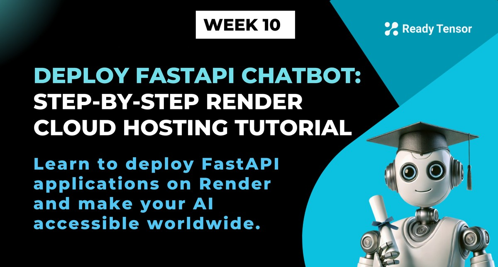

--DIVIDER--

---

[🏠 Home - All Lessons](https://app.readytensor.ai/hubs/ready_tensor_certifications)

[⬅️ Previous - FastAPI Fundamentals](https://app.readytensor.ai/publications/3FLDYUhZnlTu)
[➡️ Next - Gradio for Demos](https://app.readytensor.ai/publications/pZxv9sd7Bk75)

---

--DIVIDER--

# TL;DR

You've built an AI assistant that runs locally on your machine. Now it’s time to take the next step: deploy it to the cloud so the world can use it. In this lesson, you’ll follow along with a video walkthrough and learn how to host your FastAPI app on Render — a simple, beginner-friendly platform that makes deployment painless.

---

--DIVIDER--

# From Local to Live: Deploying Your AI Chatbot with Render 🌐

Great job building those FastAPI applications in our previous lecture! You've successfully wrapped your AI chatbot and RAG system in beautiful APIs with automatic documentation. But here's the thing: they're still sitting in your local system, accessible only to you. It's like having a brilliant conversation partner locked in your room when they could be helping people around the world.

In this lecture, we're going to change that. We're going to deploy our chatbot to the cloud and make it publicly accessible!

---

--DIVIDER--

# Why Render? Simple, Free, and Perfect for Learning 🎯

--DIVIDER--

We chose Render for this deployment because of its simplicity and the fact that it's free to get started. You can literally follow along without spending a dime! Render handles all the complex infrastructure stuff behind the scenes, so you can focus on what matters: getting your AI application live and accessible.

There are other excellent options like Heroku, Railway, Vercel, AWS, Google Cloud, and Azure, but Render strikes the perfect balance between simplicity and power for our learning journey.

---

--DIVIDER--

# Start Here: Your Deployment-Ready Chatbot Repo 🚀

We've prepared everything you need to follow along. Head over to https://github.com/3rd-Son/chatbot and fork the repository. This contains our FastAPI chatbot code, properly structured and ready for deployment.

The beauty of what we're about to do is that once you understand this process, you can deploy _any_ FastAPI application, whether it's a simple chatbot, a complex RAG system, or even multi-agent workflows. The principles remain the same.

---

--DIVIDER--

:::caution{title="Caution"}

 <h2>Before You Go Live: Protect Yourself from Surprise Bills</h2>
 
 If your chatbot makes real API calls to paid services like OpenAI, be careful when deploying it publicly. Once it’s online, anyone with the link can send queries — and every one of those costs you money.
 
 We recommend one of two options:
 
 - **Turn your app on only when needed.** You can keep it deployed but shut down the service (or restrict access) when you’re not actively demoing it.
 - **Set a hard usage cap with your provider.** Platforms like OpenAI let you define monthly spend limits or alert thresholds. Use them.
 
 This lesson is about learning deployment, not racking up bills. So take a few minutes to make sure you’re not accidentally building a 24/7 LLM vending machine for the internet.
 
 :::
 
 ---

--DIVIDER--

# Watch the Deployment Walkthrough 📹

This lesson centers around a practical walkthrough video. You’ll see every step, from forking the chatbot code to pushing it live:

- How to set up the project on Render
- How to configure environment variables
- How to verify your FastAPI app is actually running in the cloud

**Watch the video below to see how you too can deploy your FastAPI chatbot on Render:**

:::youtube[Title]{#5SZh9J0BkBg}

---

--DIVIDER--

# What’s Actually Happening Under the Hood? 🎩

Here’s what Render does while you’re clicking buttons and filling out forms:

1.  It provisions a cloud server.
2.  It clones your repo into that server.
3.  It installs dependencies (from your `requirements.txt`).
4.  It starts your FastAPI app using the command in your `render.yaml`.
5.  It assigns a public URL to your app — instantly available to anyone.

No servers to SSH into. No need to know how systemd works. No networking setup. Just a clean abstraction.

That said, it’s not magic. You’re still learning the real parts of deployment: process management, environment variables, runtime logs, public accessibility, and how code moves from local to live.

---

--DIVIDER--

# A Few Caveats About the Free Tier on Render ⚠️

Before you fall in love with Render forever, let’s set expectations.

Free Render services "sleep" when idle — so the first user to access your app might wait a few seconds for it to wake up. This is fine for testing and demos, but not ideal for low-latency production.

Also, Render isn’t designed for real-time services, long-running background tasks, or highly customizable networks. For those needs, you’ll eventually want to explore platforms like AWS, GCP or other cloud providers.

Still, for 90% of your AI projects and experiments — especially in this program — Render is more than enough.

---

--DIVIDER--

# The Power of Going Live 💪

There's something magical about seeing your AI application running in the cloud. It's no longer just code on your laptop; it's a living, breathing service that can help real people solve real problems. You can share the URL with friends, add it to your portfolio, or even use it as the backend for a mobile app.

This is the moment when you truly transition from learning AI to building AI products that matter.

--DIVIDER--

---

[🏠 Home - All Lessons](https://app.readytensor.ai/hubs/ready_tensor_certifications)

[⬅️ Previous - FastAPI Fundamentals](https://app.readytensor.ai/publications/3FLDYUhZnlTu)
[➡️ Next - Gradio for Demos](https://app.readytensor.ai/publications/pZxv9sd7Bk75)

---
