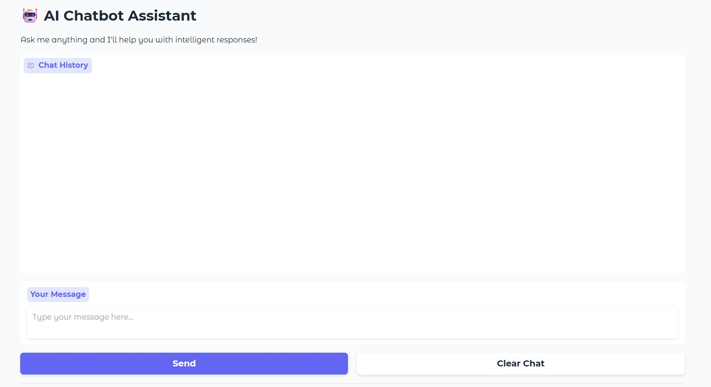

--DIVIDER--

---

[🏠 Home - All Lessons](https://app.readytensor.ai/hubs/ready_tensor_certifications)

[⬅️ Previous - App Deployment on Render](https://app.readytensor.ai/publications/i3gMkNkTokWR)
[➡️ Next - Streamlit for Demos](https://app.readytensor.ai/publications/KNnkpIlfXLoP)

---

--DIVIDER--

# TL;DR

In this lesson, you’ll build a sleek, self-contained chatbot app using **Gradio + LangChain + Groq**. No separate backend. No complex routing. Just one script that launches a beautiful UI and even gives you a public link to share your demo.

Perfect for:

- Portfolio projects
- Job interviews
- Prototyping AI ideas in minutes

This is not for production-scale deployment. But it’s an ideal way to showcase your work—instantly.

---

--DIVIDER--

:::info{title="Info"}

 <h2>Lesson Resources</h2>
 
 **📁 Code Repository**: All the code for this lesson is available in the [attached repository](https://github.com/readytensor/rt-agentic-ai-cert-week10). You can follow along or reference the complete implementation as you build.
 
 **🎥 Video Walkthrough**: Below you'll find a step-by-step video showing how to deploy your Gradio app to Hugging Face Spaces for permanent hosting.
 
 :::
 
---

--DIVIDER--

# Give Your App a Frontend

In the last two lessons (1a and 1b), you built an API service using **FastAPI** and deployed it to the cloud with **Render**. That approach is practical and production-friendly—but let’s be honest, it’s not very pretty.

What if you wanted to:

- Let users interact with your app through a **clean web UI**?
- Share a working demo with collaborators or employers?
- Build a fast prototype or proof-of-concept inside your company?

For all of that, we have **Gradio** (and in the next lesson, **Streamlit**).

---

--DIVIDER--

# Building AI Apps Using Gradio

Gradio is a Python library from **Hugging Face** that lets you create interactive UIs for your models and apps—without touching frontend code. It’s fast, minimal, and tailor-made for demos and assistants like yours.


Here’s what makes it a great starting point:

✅ Instant UI: Add text boxes, buttons, and chat history in minutes
✅ Fully self-contained: No backend server needed
✅ Public link sharing: Demo your app without deploying
✅ Native LLM support: Works seamlessly with LangChain workflows

It’s a perfect fit for LLM-based assistants, quick demos, and idea validation.

So let’s build a Gradio app that wraps your LangChain logic in a slick, shareable UI.

---

--DIVIDER--

# What You’ll Build

A fully functional AI assistant that:

- Uses Groq’s blazing-fast LLMs via LangChain
- Runs in your browser with a clean UI
- Can be shared with others using a public Gradio link

All in one Python file.

---

--DIVIDER--

# Step-by-Step: Gradio Chatbot with LangChain

Let's walk through building a simple chatbot app using Gradio and LangChain. This will give you a solid foundation for creating interactive AI applications.

--DIVIDER--

## Prerequisites

Before running the app, make sure you have:

- Python installed
- A `.env` file with your `GROQ_API_KEY`
- These Python packages:

Create a .env file with your API key:

```plaintext
GROQ_API_KEY=your_groq_api_key_here
```

---

--DIVIDER--

## Folder Structure

Our project will have a simple structure:

```plaintext
lesson2_gradio/
├── main.py
└── requirements.txt
```

---

--DIVIDER--

## The Chatbot Logic

This part sets up your LLM and defines how the assistant should respond to user messages.

```python
from langchain_groq import ChatGroq
from langchain_core.messages import HumanMessage, SystemMessage
import os
from dotenv import load_dotenv

# Load environment variables
load_dotenv()

# Initialize the LLM
llm = ChatGroq(
    model="llama-3.1-8b-instant",
    temperature=0.7,
    api_key=os.getenv("GROQ_API_KEY")
)

def get_ai_response(user_message: str) -> str:
    messages = [
        SystemMessage(content="You are a helpful AI assistant. Answer the user's questions."),
        HumanMessage(content=user_message),
    ]
    response = llm.invoke(messages)
    return response.content

def chatbot_interface(message, history):
    if not message.strip():
        return history, ""

    bot_response = get_ai_response(message)
    history.append({"role": "user", "content": message})
    history.append({"role": "assistant", "content": bot_response})
    return history, ""
```

This gives you a smart assistant grounded in Groq’s fast LLMs, with a visible chat history for the user.

---

--DIVIDER--

## The Gradio Interface

Now we wrap that logic in a beautiful, browser-based interface.

```python
import gradio as gr

def create_interface():
    with gr.Blocks(theme=gr.themes.Soft()) as demo:
        gr.Markdown("# 🤖 AI Chatbot Assistant")
        gr.Markdown("Ask me anything and I'll help you with intelligent responses!")

        chatbot = gr.Chatbot(
            value=[],
            height=400,
            label="Chat History",
            show_copy_button=True,
            type="messages"  # new Gradio format
        )

        msg = gr.Textbox(
            placeholder="Type your message here...",
            label="Your Message",
            lines=2
        )

        with gr.Row():
            submit_btn = gr.Button("Send", variant="primary")
            clear_btn = gr.Button("Clear Chat", variant="secondary")

        submit_btn.click(chatbot_interface, inputs=[msg, chatbot], outputs=[chatbot, msg])
        msg.submit(chatbot_interface, inputs=[msg, chatbot], outputs=[chatbot, msg])
        clear_btn.click(lambda: ([], ""), inputs=[], outputs=[chatbot, msg])

        gr.Markdown("---")
        gr.Markdown("💡 Built with Gradio + LangChain + Groq")

    return demo
```

Finally, launch the app with:

```python
if __name__ == "__main__":
    demo = create_interface()
    demo.launch(
        share=True,
        server_name="127.0.0.1",
        server_port=7860,
        show_error=True
    )
```

The interface keeps a visible chat history, so users see the full conversation.

---

--DIVIDER--

## Running & Sharing the App

Run the app:

```bash
python main.py
```

This launches your app at `http://127.0.0.1:7860` and (thanks to `share=True`) also gives you a public link you can share.



And just like that, you have a slick, fully functional AI assistant running in your browser!

---

--DIVIDER--

:::caution{title="Caution"}

 <h2>Anyone With the Link Can Use Your Bot</h2>
 
 Gradio makes it easy to share your app — but if it’s powered by a paid LLM (like Groq or OpenAI), every interaction can cost you.
 
 Before sharing the public link:
 
 - Make sure you're okay with external traffic. Anyone who has the link can send messages.
 - Set usage limits or alerts on your API account to avoid unexpected charges.
 
 This lesson is about building great demos, not footing the bill for strangers' curiosity. Share responsibly.
 
 :::
 
 ---

--DIVIDER--

# When (and Why) to Use This

This Gradio app is:

✅ Great for rapid demos
✅ Excellent for interviews or portfolios
✅ A simple way to test LLM ideas with users

But it’s not for production. There’s no user auth, no rate limiting, no database—just a clean wrapper around your logic.

For production-ready deployment, see our FastAPI + Render lesson.

---

--DIVIDER--

## Want to Deploy Permanently?

Gradio integrates seamlessly with **Hugging Face Spaces**.

You can host your app with:

- No DevOps
- No servers
- Just a `requirements.txt` and your `.py` file

We cover that in the **video** for this lesson.

:::youtube[Title]{#1Hi228zVGQw}

In the video, you'll learn how to:

- Set up a Hugging Face Space using the Gradio SDK
- Push your code (and requirements) using Git
- Configure secrets like your Groq API key securely
- Debug common runtime issues (missing requirements, missing env vars)
- Share a public demo link with anyone

---

--DIVIDER--

# Gradio in a Nutshell, Streamlit Up Next

Gradio is simple, flexible, and purpose-built for rapid prototyping. If you want to get your AI assistant into someone’s hands in under 10 minutes, this is the way to do it.

In the next lesson, we’ll explore **Streamlit** — another UI framework that gives you more layout flexibility, better data visualization, and the ability to build full dashboards and multi-page apps.

But for fast AI apps in a single file?

Gradio is tough to beat.

--DIVIDER--

---

[🏠 Home - All Lessons](https://app.readytensor.ai/hubs/ready_tensor_certifications)

[⬅️ Previous - App Deployment on Render](https://app.readytensor.ai/publications/i3gMkNkTokWR)
[➡️ Next - Streamlit for Demos](https://app.readytensor.ai/publications/KNnkpIlfXLoP)

---
