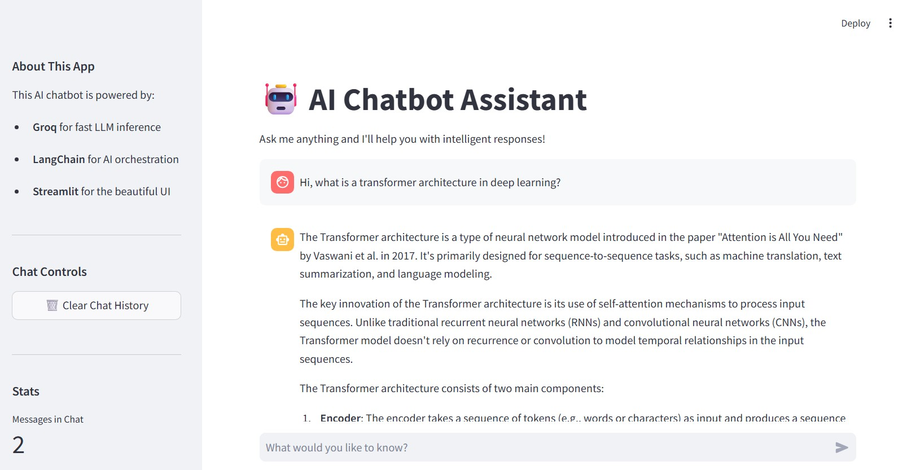

--DIVIDER--

---

[🏠 Home - All Lessons](https://app.readytensor.ai/hubs/ready_tensor_certifications)

[⬅️ Previous - Gradio for Demos](https://app.readytensor.ai/publications/pZxv9sd7Bk75)

---

--DIVIDER--

# TL;DR

In this lesson, you’ll build a polished, browser-based chatbot app using **Streamlit + LangChain + Groq**. It runs from a single Python file — with persistent chat history, a sidebar for controls, and a clean UI that feels like a real product. You’ll also learn how to deploy it to **Streamlit Cloud** and share your assistant with the world.

This tutorial is perfect for:

- Developer portfolios
- Interactive AI demos
- Internal tools and prototypes

Unlike Gradio, which we covered in the [previous](https://app.readytensor.ai/publications/pZxv9sd7Bk75) lesson, Streamlit gives you more layout flexibility and session state — ideal for apps that go beyond a one-shot demo.

This isn’t full-scale production, but it’s a big step closer.

---

--DIVIDER--

:::info{title="Info"}

 <h2>Lesson Resources</h2>
 
 **📁 Code Repository**  
 All the code for this lesson is available in the [GitHub repo](https://github.com/readytensor/rt-agentic-ai-cert-week10). Use it to follow along or explore the full implementation.
 
 **🎥 Deployment Walkthrough**  
 Watch the video below for a step-by-step guide to deploying your Streamlit chatbot to **Streamlit Cloud**, so you can share it with others using a public link.
 
 :::
 
---

--DIVIDER--

# Give Your Agent a Frontend (That Feels Like an App)

This week, we’re exploring different ways to package and share your agentic AI apps.

In the last lesson, you built a demo-ready chatbot using **Gradio**, and deployed it to **Hugging Face Spaces** — an excellent option for lightweight sharing and quick prototypes.

Now it’s time to meet another popular tool in the LLM builder’s toolkit: **Streamlit**.

Unlike Gradio, which prioritizes zero-setup demos, Streamlit gives you more control over layout, persistent session state, and interactivity. That makes it a better fit for:

- Chatbots with memory
- Tools with sliders, filters, or user options
- Portfolio apps that look closer to real products
- Internal prototypes that simulate full applications

It’s still not a production deployment platform — but it’s a fantastic frontend layer for turning your assistant into something that feels interactive, polished, and genuinely useful.

In this lesson, you’ll build a chatbot app using **LangChain + Groq + Streamlit**, complete with a sidebar, session memory, and optional cloud deployment via **Streamlit Cloud**.

---

--DIVIDER--

# What Is Streamlit (and What Should You Know Before You Start)?

**Streamlit** is a Python framework that turns scripts into web apps — no HTML, no JS, no CSS required. It’s reactive, pythonic, and designed for rapid iteration.


Here’s what makes it unique:

- **Reactive by design** — UI updates automatically when values change
- **Session-aware** — You can persist chat history, selections, or API calls
- **Professional out-of-the-box styling** — No need to design anything yourself
- **Perfect for AI/ML workflows** — From dashboards to chatbots to eval tools
- **Easy to deploy** — Push to GitHub, connect to Streamlit Cloud, done

**Critical Note:** Unlike Jupyter notebooks, Streamlit apps must be written in .py files and run from your terminal or IDE. You cannot run Streamlit in .ipynb files.

With that in mind, let’s build a full-featured assistant interface — and by the end, you’ll even have the option to host it on Streamlit Cloud with a public share link.

---

--DIVIDER--

# What You'll Build

In this lesson, we’ll recreate the same chatbot from the **Gradio** lesson, but this time using **Streamlit**.

It’s powered by **LangChain** and **Groq**, runs in your browser, and includes a clean sidebar with controls and stats. Thanks to Streamlit’s session state, the app displays the full conversation on screen.

You’ll also learn how to deploy it to **Streamlit Cloud** and share a public link — all from a single Python file.

---

--DIVIDER--

# Step-by-Step: Streamlit Chatbot with LangChain

Let’s bring this assistant to life — same logic as before, but a different UI framework. You’ll see just how quickly Streamlit turns Python scripts into interactive apps.

--DIVIDER--

## Prerequisites

Make sure you have Python installed. Then create a `.env` file with your **Groq API key**:

```plaintext
GROQ_API_KEY=your_groq_api_key_here
```

You’ll also need a few dependencies:

```bash
pip install streamlit langchain-groq python-dotenv
```

---

--DIVIDER--

## Folder Structure

Keep things minimal:

```plaintext
lesson3_streamlit/
├── .env
├── main.py
└── requirements.txt
```

All of the app logic will go in `main.py`, and we’ll use `requirements.txt` to specify our dependencies for deployment, and the `.env` file to securely store our API key.

Our dependencies are:

```plaintext
langchain~= 0.3.26
langchain_groq~=0.3.6
langchain-core~=0.3.69
python-dotenv~=1.1.1
streamlit~=1.47.0
```

---

--DIVIDER--

## The Chatbot Logic

Let’s start by setting up the core logic in `main.py` — loading the model and defining how the assistant responds.

We’re using `langchain_groq` to connect to Groq’s blazing-fast LLMs, and we’ll cache the model load using Streamlit’s `@st.cache_resource` so it doesn’t reload on every interaction.

```python
from langchain_groq import ChatGroq
from langchain_core.messages import HumanMessage, SystemMessage
import streamlit as st
import os
from dotenv import load_dotenv

# Load environment variables from .env in current directory
load_dotenv()

# Initialize the LLM with caching for performance
@st.cache_resource
def load_llm():
    api_key = os.getenv("GROQ_API_KEY")
    if not api_key:
        st.error("❌ GROQ_API_KEY not found in environment variables!")
        st.error("Please make sure you have a .env file with your Groq API key.")
        st.stop()
    return ChatGroq(
        model="llama-3.1-8b-instant",
        temperature=0.7,
        api_key=api_key
    )

def get_ai_response(user_message: str, llm) -> str:
    messages = [
        SystemMessage(content="You are a helpful AI assistant. Answer the user's questions clearly and concisely."),
        HumanMessage(content=user_message),
    ]
    response = llm.invoke(messages)
    return response.content
```

---

--DIVIDER--

## The Streamlit Interface

Now we’ll build the frontend — all in Python, no HTML or CSS needed.

This code creates a chat-style layout, shows your message history, and adds a sidebar for clearing the chat and tracking usage. It’s clean, reactive, and takes almost no extra code beyond what you’ve already written.

```python
def main():
    # Page configuration
    st.set_page_config(
        page_title="AI Chatbot Assistant",
        page_icon="🤖",
        layout="wide",
        initial_sidebar_state="expanded"
    )

    # Main title and description
    st.title("🤖 AI Chatbot Assistant")
    st.markdown("Ask me anything and I'll help you with intelligent responses!")

    # Load the LLM
    llm = load_llm()

    # Initialize chat history in session state
    if "messages" not in st.session_state:
        st.session_state.messages = []

    # Display chat messages from history on app rerun
    for message in st.session_state.messages:
        with st.chat_message(message["role"]):
            st.markdown(message["content"])

    # Accept user input
    if prompt := st.chat_input("What would you like to know?"):
        st.session_state.messages.append({"role": "user", "content": prompt})

        with st.chat_message("user"):
            st.markdown(prompt)

        with st.chat_message("assistant"):
            with st.spinner("Thinking..."):
                response = get_ai_response(prompt, llm)
            st.markdown(response)

        st.session_state.messages.append({"role": "assistant", "content": response})

    # Sidebar for additional features
    with st.sidebar:
        st.markdown("### About This App")
        st.markdown("This AI chatbot is powered by:")
        st.markdown("- **Groq** for fast LLM inference")
        st.markdown("- **LangChain** for AI orchestration")
        st.markdown("- **Streamlit** for the beautiful UI")

        st.markdown("---")
        st.markdown("### Chat Controls")

        if st.button("🗑️ Clear Chat History", use_container_width=True):
            st.session_state.messages = []
            st.rerun()

        st.markdown("---")
        st.markdown("### Stats")
        st.metric("Messages in Chat", len(st.session_state.messages))

        if st.session_state.messages:
            user_messages = len([msg for msg in st.session_state.messages if msg["role"] == "user"])
            st.metric("Questions Asked", user_messages)

if __name__ == "__main__":
    main()
```

---

--DIVIDER--

## Running & Sharing the App

Save the code as `main.py`, then launch your app with:

```bash
streamlit run main.py
```

Streamlit will open the app in your browser at `http://localhost:8501`. You now have a fully functional AI chatbot, styled and interactive — ready to use or share.



Now, you can interact with your assistant, see the chat history, and even clear it with a button click. The sidebar provides additional context and controls. This is a polished, professional interface that you can showcase in your portfolio or use for demos.

---

--DIVIDER--

# When (and Why) to Use This

If you're looking to demo your assistant in a way that feels more like a real app — but still want the simplicity of a single Python script — Streamlit is a great choice.

It's especially useful for:

✅ **Portfolio projects** that showcase your AI skills to employers  
 ✅ **Internal company prototypes** for testing ideas with stakeholders  
 ✅ **Student capstone projects** that need a professional presentation layer  
 ✅ **Proof-of-concept demos** for clients or collaborators  
 ✅ **Interactive tutorials** where users can experiment with your models

The persistent UI makes it feel polished, while the layout flexibility lets you add stats, sidebars, or custom widgets without much effort.

That said, **it's still just a frontend**. You won't get user authentication, rate limiting, or background jobs here. So, use it for demos or quick prototypes, but not for production apps that need robust backend features.

**Think of Streamlit as your "presentation layer"** — perfect for showcasing what your AI can do, but not for handling thousands of concurrent users or complex business logic.

---

--DIVIDER--

# Want to Deploy Permanently?

Running the app locally is a great start — but if you want to share your work, **Streamlit Cloud** makes deployment easy.

Just push your code (including your `.py` and `requirements.txt`) to a public GitHub repo, then connect it to Streamlit Cloud. It handles the rest — setting up the environment, launching your app, and giving you a public link to share.

Secrets like your Groq API key can be added securely through the dashboard, and any time you push an update to your repo, the app automatically redeploys.

We cover this entire process in the video below.

:::youtube[Title]{#mCePmlLmXXU}

---

--DIVIDER--

## Streamlit vs. Gradio: Which Should You Use?

Gradio and Streamlit serve different needs, and both are worth having in your toolkit.

Streamlit gives you more layout control and is ideal when you want the app to look and feel like a real product — something you might use in a team setting or showcase in a portfolio. The ability to persist state, track metrics, and organize your app with sidebars and sections makes it great for more complex projects.

Gradio, on the other hand, is all about speed. You can go from zero to a working demo in minutes, and share it instantly via Hugging Face Spaces. It’s fantastic for simple, focused assistants or one-off experiments.

In practice, most developers pick the one that fits the moment — and switch depending on the audience, project type, or delivery timeline.

---

--DIVIDER--

# What’s Next

With this lesson, we’ve wrapped up our tour of lightweight deployment options — the kind best suited for demos, portfolios, hackathons, or internal prototypes.

Whether you used **Gradio** for instant sharing or **Streamlit** for more control and polish, you now have the tools to package and present your agentic AI systems with confidence.

But what if your assistant needs to go beyond demos? What if it needs to handle real-world traffic, scale with demand, and stay resilient under stress?

In the upcoming lesson, you’ll learn how to design **defensive agentic systems** — ones that handle failures gracefully, respond under pressure, and stay usable even when parts of the pipeline degrade.

We’re moving beyond “it works on localhost” — and into the real-world mindset of robust AI engineering.

---

--DIVIDER--

---

[🏠 Home - All Lessons](https://app.readytensor.ai/hubs/ready_tensor_certifications)

[⬅️ Previous - Gradio for Demos](https://app.readytensor.ai/publications/pZxv9sd7Bk75)

---
