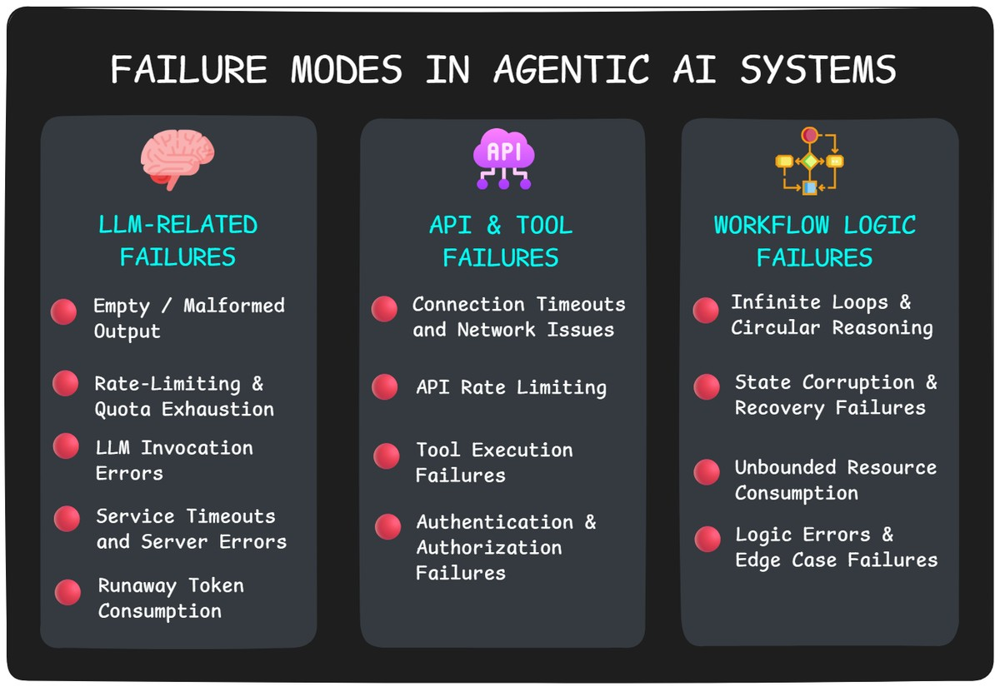
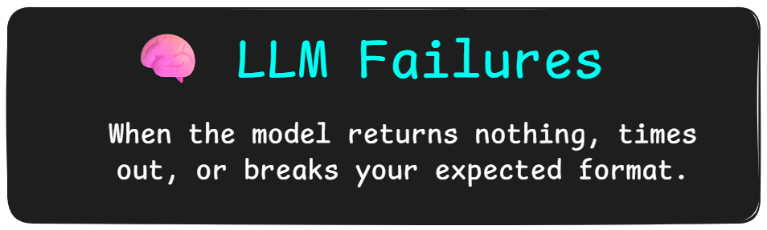
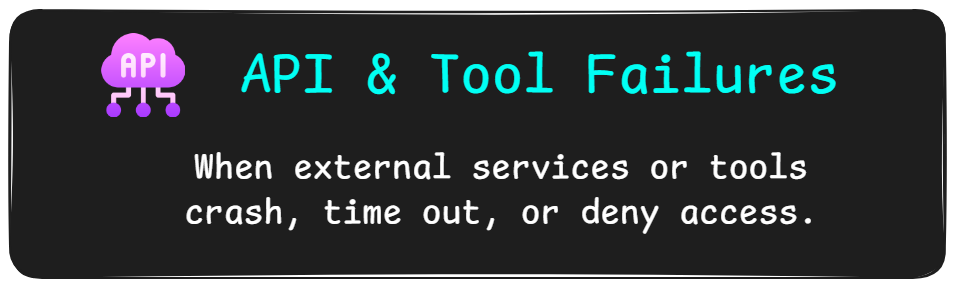
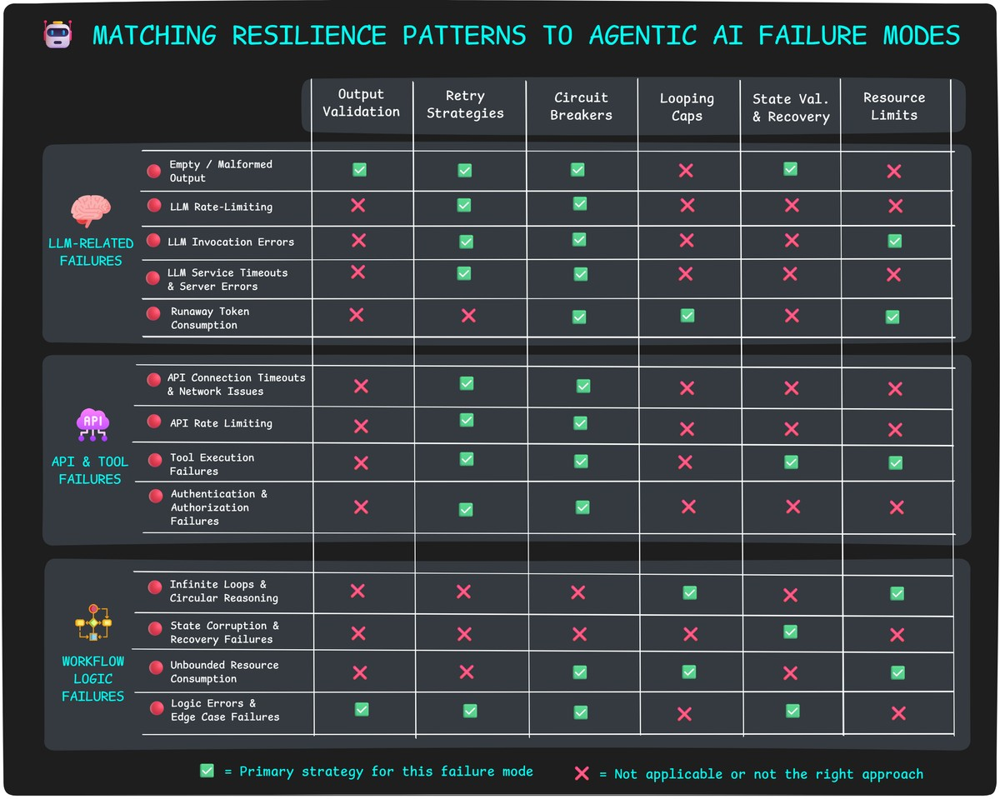

--DIVIDER--

---

[🏠 Home - All Lessons](https://app.readytensor.ai/hubs/ready_tensor_certifications)

[⬅️ Previous - Streamlit for Demos](https://app.readytensor.ai/publications/KNnkpIlfXLoP)
[➡️ Next - Agentic System Documentation Guide](https://app.readytensor.ai/publications/Al9E4GsrKoKC)

---

--DIVIDER--

# TL;DR

This lesson teaches you how to make your agentic AI systems resilient to real-world failures — from LLM errors and tool crashes to timeouts and infinite loops. You'll learn key defensive patterns like retries, fallbacks, and state validation, along with strategies for maintaining a smooth user experience when things go wrong. By the end, you’ll be able to build robust systems optimized for reliability and user trust.

---

--DIVIDER--

# From Demos to Dependability

Over the past few lessons, you've wrapped your agent in an API, deployed it to the cloud, and built slick demos with Gradio and Streamlit. You've shipped something real — and that's no small feat.

But let's be honest: you've been operating in safe territory. Lightweight deployments. Controlled environments. Happy-path usage. If something broke, it was just a demo glitch, not a production crisis.

Now it's time to level up.

Your system is about to face real users, real tools, and real-world conditions — where failures aren’t just inconvenient, they’re costly. A crashing tool, a hallucinating LLM, or a timed-out API might look like minor glitches on the surface - but to your users, they feel like broken promises.

Fragile systems erode confidence in the product, the team, and AI itself. But resilient systems? They earn loyalty by working when it matters most.

This lesson is about building that kind of trust. You’ll learn what breaks in production agentic systems, and how to design for failure without falling apart. We’ll cover common failure modes, defensive patterns, graceful degradation, and workflows that keep your agents usable even when components fail.

This is where demos become dependable.
Let’s make your system resilient.

---

--DIVIDER--

# What Breaks in the Real World?

So what actually goes wrong when agentic systems hit production?

Short answer: more than you'd expect. And often, it’s not the dramatic crash that alerts you — it's the subtle failure that goes undetected, slowly eroding trust, wasting resources, or blocking progress without any obvious signal.

Let’s walk through the most common failure modes we’ve seen in the wild — and why they matter more than you think.

--DIVIDER--



--DIVIDER--

## LLM-Related Failures

Your agent's brain is an LLM, but that brain can be unpredictable. Even when your prompts are perfect and your architecture is solid, the LLM itself can fail in ways that break your entire workflow — often at the worst possible moments.



**Empty or Malformed Output**

Sometimes your LLM just... gives up or gets creative. You might get an empty response with no explanation, or the LLM decides to wrap your JSON in markdown blocks, add chatty commentary, or invent new field names. Either way, your parsing code explodes and your user gets a cryptic error message.

_Real-world example_: You expect `{"status": "complete", "next_step": "review"}` but get `Sure! Here's the JSON you requested: json\n{"status": "complete", "next_step": "review"}\n` — and your JSON parser crashes.

**Rate Limiting and Quota Errors**

The LLM provider hits you with usage limits — too many requests per minute, monthly quota exceeded, or concurrent request limits. Your agent gets 429 errors instead of responses, breaking the workflow until limits reset.

_Real-world example_: Your content generation agent works fine in testing, but during a marketing campaign launch, it hits OpenAI's rate limits and starts returning "Rate limit exceeded" for every request.

**LLM Invocation Errors**

The LLM service sometimes throws unexpected errors — maybe a 500 server error, safety filter rejection, invalid model parameters, or mysterious API failures. These catch you off guard because they're not the "normal" failures you'd expect.

_Real-world example_: Your document analysis agent tries to process a 50-page report in one go, hits the context limit, and crashes with "Input too long" instead of processing the document in chunks.

**Service Timeouts and Server Errors**

The LLM service becomes unavailable — network timeouts, server overload (500 errors), or temporary outages. Your agent waits indefinitely or crashes instead of handling the failure gracefully.

_Real-world example_: During peak hours, your research assistant times out after 30 seconds waiting for GPT-4 to respond, leaving users with spinning loading indicators.

**Runaway Token Consumption**

Your LLM decides that "thorough" means "unlimited" and starts generating responses that never end. Without proper controls, a single runaway response can drain your daily API quota.

_Real-world example_: Your research agent uses chain-of-thought reasoning to answer "What's the best programming language for beginners?" and goes down a rabbit hole analyzing the history of programming languages, comparing syntax complexity, evaluating job market trends, and debating educational philosophy — generating 10,000 tokens of "reasoning" for what should have been a simple recommendation.

---

--DIVIDER--

--DIVIDER--

## API & Tool Failures



Your LLM might be cooperating, but agentic systems don't work in isolation. They depend on external APIs, databases, file systems, and custom tools — each one a potential point of failure that can bring your entire workflow to a halt.

**Connection Timeouts & Network Issues**

The classic failure: your agent tries to call an external API, and... nothing. Network hiccups, DNS issues, or the remote service being overwhelmed. Your agent sits there waiting indefinitely while your user watches a loading spinner.

_Real-world example_: Your research agent tries to fetch data from a financial API during market hours when everyone else is hammering the same endpoint. The request times out after 30 seconds, and your workflow dies.

**Rate Limiting & Quota Exhaustion**

APIs don't give you unlimited access. Hit too many requests too quickly, or exceed your monthly quota, and you get shut down. Your agent might work perfectly in testing with light usage, then crash in production when real traffic hits.

_Real-world example_: Your content agent uses a translation API that allows 1000 calls per hour. During a busy afternoon, you hit the limit and every subsequent translation request returns "429 Too Many Requests."

**Tool Execution Failures**

Custom tools can fail in spectacular ways. File operations hit permission errors. Database queries timeout. Code execution tools crash on malformed input. Web scrapers encounter sites that block them. Unlike API failures, these often happen silently with unclear error messages.

_Real-world example_: Your agent's file analysis tool tries to process a corrupted PDF. Instead of a clean error, it throws a cryptic exception that crashes the entire agent workflow.

**Authentication & Authorization Failures**

API keys expire. Tokens get revoked. Services change their authentication requirements. Your agent worked yesterday, but today every API call returns "401 Unauthorized" and you have no idea why.

_Real-world example_: Your CRM integration agent stops working because someone rotated the API key in the admin panel but forgot to update your deployment configuration.

---

--DIVIDER--

## Workflow Logic Failures


Your LLM and tools might be working perfectly, but agentic systems can still fail catastrophically due to flawed workflow logic. These are the sneaky failures that emerge from how your agent reasons, plans, and executes — turning your helpful assistant into an expensive, runaway process.

**Infinite Loops and Circular Reasoning**

Your agent gets stuck in a loop, repeatedly trying the same failed approach or bouncing between two states forever. Without iteration limits, it burns through tokens and API calls until you manually kill it — or your budget does.

_Real-world example_: Your research agent tries to find information about a topic, doesn't get satisfactory results, so it reformulates the query and searches again... and again... and again. After 50 iterations and $200 in API costs, it's still "refining" the same search.

**State Corruption and Recovery Failures**

Your agent's internal state gets corrupted — maybe it loses track of what it's done, forgets critical context, or develops contradictory beliefs about the current situation. When this happens, all subsequent actions are based on wrong information.

_Real-world example_: Your customer support agent thinks it's already collected the user's account information, but actually failed to save it. It proceeds to "process the request" with empty data, leading to confusing responses and frustrated customers.

**Unbounded Resource Consumption**

Your agent decides that "thorough" means "unlimited" and starts consuming resources without bounds. Maybe it spawns too many parallel processes, loads massive datasets into memory, or generates responses so long they crash your infrastructure.

_Real-world example_: Your document analysis agent decides to "be comprehensive" and attempts to process every PDF in a 10GB folder simultaneously, bringing your server to its knees.

**Logic Errors and Edge Case Failures**

Your workflow logic has gaps that only show up in production. Maybe your conditional statements don't cover all cases, your error handling assumes failures that never happen, or your agent makes decisions based on incomplete information.

_Real-world example_: Your scheduling agent works fine for meetings during business hours but crashes when someone tries to schedule a late-night call because you never tested timezone edge cases.

---

--DIVIDER--

# Resilience Patterns — How to Stay Ahead of Failures

You’ve seen what breaks. Now let’s focus on how to prevent small cracks from becoming full-system meltdowns. These are the core patterns that make agentic systems resilient, even when parts of the workflow go wrong.

--DIVIDER--

## 🧪 Resilient Output Parsing and Schema Validation

This pattern prevents crashes from empty responses, malformed outputs, and missing fields. Instead of hoping the LLM returns perfect JSON, enforce structure and apply validation logic upfront.

```python
from pydantic import BaseModel, Field, validator
from langchain_openai import ChatOpenAI
from langchain_core.prompts import ChatPromptTemplate

class Product(BaseModel):
    name: str = Field(...)
    price: float = Field(...)

    @validator("price")
    def fix_price(cls, v):
        return max(0.01, v) if v > 0 else 0.01

    @validator("name")
    def clean_name(cls, v):
        return v.strip() or "Unknown Product"

model = ChatOpenAI(model_name="gpt-4o-mini", temperature=0)
prompt = ChatPromptTemplate.from_template("""
Based on the catalog below, extract product info for: {description}

Catalog:
{catalog_data}
""")

chain = prompt | model.with_structured_output(Product)

result = chain.invoke({
    "description": "Two kilos of tomato",
    "catalog_data": "Tomato - $2.99/kg, Potato - $1.50/kg, Onion - $1.80/kg"
})
```

This way, the LLM is grounded in structured input, your output is validated, and bad responses don’t crash your pipeline.

> > 💡 Never assume the model got it right. Always validate before moving on.

---

--DIVIDER--

## ⏱️ Timeout and Retry Strategies (with Backoff and Limits)

This pattern mitigates **LLM timeouts**, **API failures**, and **rate-limiting or quota exhaustion** by applying retries with increasing wait times between attempts.

```python
import time

def call_with_retry(func, max_retries=3, delay=2):
    for attempt in range(max_retries + 1):
        try:
            return func()
        except Exception as e:
            if attempt == max_retries:
                raise e
            time.sleep(delay * 2 ** attempt)  # Exponential backoff

def call_llm():
    return model.invoke(prompt, timeout=30)

response = call_with_retry(call_llm)
```

Here, we retry the LLM call up to 3 times, waiting longer each time. This helps recover from transient failures without overwhelming the service.

> > 💡 Only retry **safe, repeatable actions**. Don’t retry something that causes side effects or changes state.

---

--DIVIDER--

## ⚡ Circuit Breakers and Tool-Level Fallbacks

This pattern addresses **repeated API failures** and **tool execution errors** by temporarily disabling broken services and switching to backup options. Instead of hammering a failing API forever, you "trip the circuit" and use alternatives until the service recovers.

Example: What happens if a tool fails _every time_ for 10 minutes straight?

A **circuit breaker** detects persistent failure and disables that tool temporarily — protecting the rest of the system:

```python
class ToolCircuitBreaker:
    def __init__(self):
        self.failure_counts = {}
        self.disabled_until = {}

    def call_tool(self, tool_name, tool_func, fallback_func):
        # Check if tool is disabled
        if tool_name in self.disabled_until:
            if time.time() < self.disabled_until[tool_name]:
                return fallback_func()  # Still disabled, use fallback
            else:
                del self.disabled_until[tool_name]  # Re-enable tool

        try:
            result = tool_func()
            self.failure_counts[tool_name] = 0  # Reset on success
            return result
        except Exception:
            self.failure_counts[tool_name] = self.failure_counts.get(tool_name, 0) + 1

            if self.failure_counts[tool_name] >= 5:
                # Disable tool for 10 minutes
                self.disabled_until[tool_name] = time.time() + (10 * 60)

            return fallback_func()

# Usage
breaker = ToolCircuitBreaker()

def search_web():
    return web_search_tool.invoke(query)

def use_cached_results():
    return {"results": "Using cached data", "source": "fallback"}

result = breaker.call_tool("web_search", search_web, use_cached_results)
```

In this example, if the `web_search` tool fails 5 times in a row, it gets disabled for 10 minutes. During that time, the system uses cached results instead.

> > 💡 Graceful degradation beats complete failure — every time.

---

--DIVIDER--

## 🔁 Iteration Caps and Loop Detection

This pattern prevents agents from getting stuck in **infinite loops** or **excessive retries** by enforcing a hard limit on how many times a node or flow can repeat.

In LangGraph, track iteration count in the agent state:

```python
def should_continue(state):
    max_iterations = 10
    state["iteration"] = state.get("iteration", 0) + 1
    return state["iteration"] <= max_iterations
```

Use this check before re-entering a node or loop. If the cap is reached, **route to a fallback node** instead of letting the agent run indefinitely:

```python
if not should_continue(state):
    return route_to("fallback_summary")
```

You can also log the event or surface a polite message to the user if needed.

✅ **Solves for:**

- Infinite loops in LangGraph workflows
- Excessive reasoning cycles that never converge
- Runaway token usage from looped LLM/tool calls
- Stalled systems with no exit condition

> > 💡 Add debug logs inside loops to catch repetition early and set up alerts before costs spiral.

---

--DIVIDER--

## 🧬 State Validation and Recovery Safeguards

Your agent’s state is its memory. If it’s corrupted — missing a key, storing the wrong type, or carrying inconsistent values — the system will fail in weird, hard-to-debug ways.

Defend your state like it’s critical infrastructure. Because it is.

- Always check state before passing to the next node.
- Use default values when a key might be missing.
- Add sanity checks: `"step" in state`, `type(state["doc"]) == str`, etc.
- On failure, reset or truncate state safely.

```python
if "user_query" not in state:
    state["user_query"] = "[MISSING]"
```

And log everything.

> > 💡 Defensive programming is your friend. Assume state can be corrupted and design for recovery.

---

--DIVIDER--

## 💥 Resource Usage Limits and Tool Sandboxing

Some tools can do too much — spawn subprocesses, load huge files, flood the network. Even simple Python tools can become dangerous without limits.

Set bounds around:

- Maximum memory used
- Max execution time per tool
- Number of concurrent calls
- File sizes or document chunk count

If your system is running in a shared or limited environment, consider actual sandboxing — like running risky tools in containers or subprocesses with strict resource controls.

```python
# Example: limit document chunking
if len(chunks) > 100:
    raise ValueError("Too many chunks to process")
```

> > 💡 If the resource limit is temporary or usage-based, consider deferring the task or telling the user to retry later. If it’s absolute, fail early with a clear explanation.

---

--DIVIDER--

# Graceful Degradation and User Trust

Even after preventative measures, failures will still happen. The key is how your system responds when things go wrong.

- When it’s recoverable, use a fallback.
- When it’s partial, inform the user.
- When it’s critical, exit cleanly and explain why.

Here’s how to decide what to do.

--DIVIDER--

 <h2>💡 How to Handle Different Failure Types</h2>
 
 | Type           | Examples                                                      | Response Strategy                          | Goal                                     |
 | -------------- | ------------------------------------------------------------- | ------------------------------------------ | ---------------------------------------- |
 | ✅ Recoverable | Tool down, LLM malformed output, file too large               | Use fallback, default, or skip gracefully  | Keep workflow moving with minimal impact |
 | ⚠️ Partial     | Step fails but others work, can't find info, transient errors | Inform user, offer retry or alternate path | Maintain user flow with transparency     |
 | ❌ Critical    | State corruption, max loop reached, invalid auth              | Fail cleanly, explain, halt the workflow   | Protect system integrity and user trust  |
 
 ---

--DIVIDER--

# Resilience Strategy Cheat Sheet

Use this matrix to quickly identify which defensive patterns to implement based on the specific failures you're trying to prevent. Most failure modes benefit from multiple overlapping strategies — defense in depth is your friend.



Remember: resilient systems combine multiple patterns rather than relying on any single defense mechanism.

---

--DIVIDER--

# From Fragile to Fault-Tolerant

Well done — you’ve learned how to build a resilient system. You’ve gone beyond happy-path demos and designed for failure, recovery, and reliability.

But this isn’t the final stop.

To make your system truly production-ready, there’s one last step: documentation. Not the boring kind — the kind that tells your ops team how things work, what to monitor, and what knobs they can tune when things go wrong.

That’s what we’ll cover next.

--DIVIDER--

---

[🏠 Home - All Lessons](https://app.readytensor.ai/hubs/ready_tensor_certifications)

[⬅️ Previous - Streamlit for Demos](https://app.readytensor.ai/publications/KNnkpIlfXLoP)
[➡️ Next - Agentic System Documentation Guide](https://app.readytensor.ai/publications/Al9E4GsrKoKC)

---
