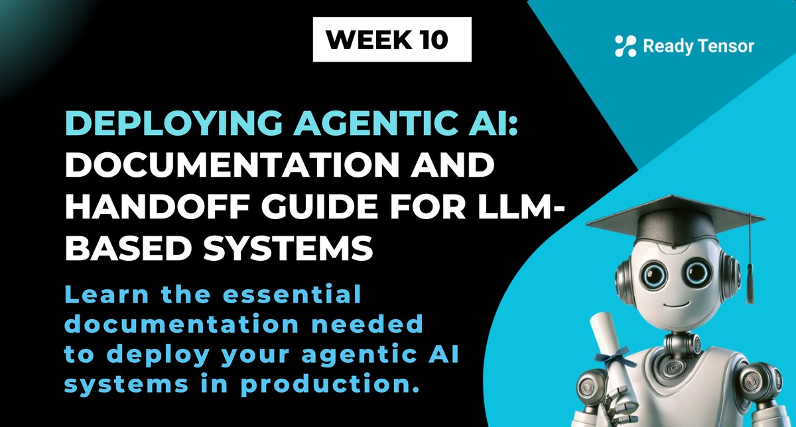
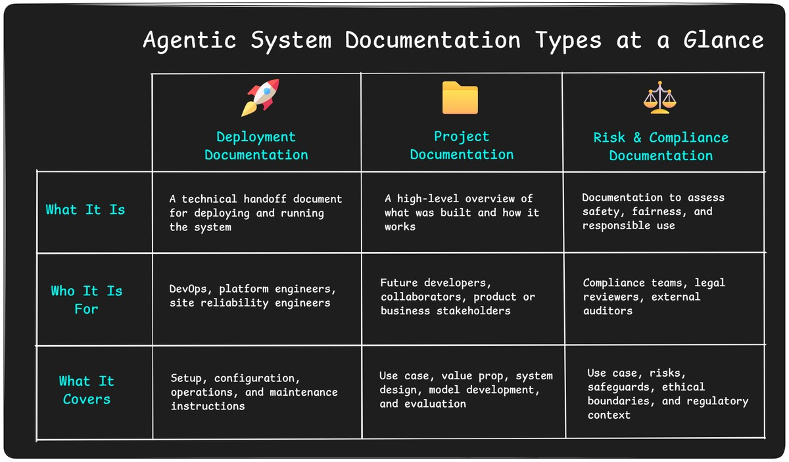
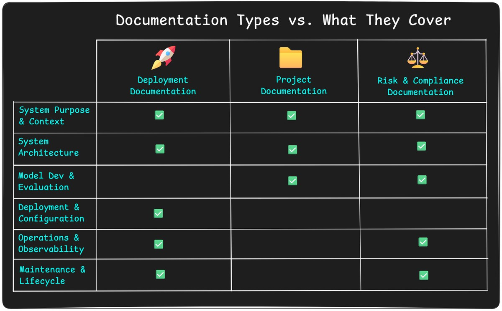

--DIVIDER--

---

[🏠 Home - All Lessons](https://app.readytensor.ai/hubs/ready_tensor_certifications)

[⬅️ Previous - Resilience in Agentic AI](https://app.readytensor.ai/publications/S1AMb9G3IMqX)

---

--DIVIDER--

# TL;DR

In this lesson, you’ll learn how to document your agentic AI system so it can be deployed, monitored, and maintained by others. We’ll break down what to include, what to hand off, and how to choose the right level of documentation tailored to your audience and deployment setting — saving everyone time and headaches.

---

--DIVIDER--

# The Most Boring, Most Important Thing You'll Do

Let’s be honest.

Nobody likes writing documentation (not even this article's author).

It’s the part of the project that always gets pushed to “later,” after the cool stuff is done. You’ve built a working system, wrapped up the final tests, maybe even deployed a demo — and now someone says: _“Can you document it before we hand it off?”_

The temptation is real.
_"We’ll just send them the repo."_
_"The code is the documentation."_
_"We’ll hop on a call and walk them through it."_
_"The PM already made a deck — that should be enough, right?"_

Trust us, we’ve been there. More than once.

And here’s what we’ve learned: **skipping documentation never actually saves time**. It just **shifts the pain** to deployment week — or worse, to production fire drills. Your ops team will ask for clarification. Your model will break silently and nobody will know how to debug it. Or someone will reconfigure the system in a way that silently kills its performance — and you’ll be the one called in to fix it.

Now, documentation isn’t about writing a novel.
It’s about writing just enough so others can keep your system running — without needing you in the loop every time something changes, breaks, or needs to scale.

In this lesson, we’ll show you what that looks like.
What to include, how much is enough, and why it’s always worth the effort.

Let’s get into it.

---

--DIVIDER--

# What Kind of Documentation Do You Actually Need?

First off — if your project has reached the point where you're preparing documentation for production, **congratulations**. That’s a milestone worth celebrating.

Most AI/ML projects never make it past the prototype stage. The fact that you're getting ready to hand off your system means it has real value — and real users.

Now comes the question: _What exactly do I need to document?_

The answer depends on **who you're documenting for**.
Sometimes it’s **DevOps**, who need to deploy, monitor, and maintain your system without breaking it.
Sometimes it’s **future developers or business stakeholders**, who need to understand what the system does, how it works, and whether it can be extended or reused.
And in regulated industries, it’s **compliance teams**, who care about safety, fairness, and governance.

Each audience needs different things — and that shapes what you write.

--DIVIDER--

We’ll walk through the three most common types of documentation you might produce:

- **Deployment Documentation** — the essential, no-skipping-this doc that lets DevOps run your system reliably.
- **Project Documentation** — a general-purpose project summary for future collaborators or stakeholders.
- **Risk & Compliance Documentation** — specialized documentation for regulated environments, focused on safety, privacy, and responsible use.

You won’t always need all three. But knowing what each one is for — and when it matters — will help you write just enough to keep things running smoothly.

---

--DIVIDER--

# What Should You Include in Each Type of Documentation?

We’ll now show a clear, at-a-glance view of which documentation components are typically included in each type of documentation. This gives you a practical sense of what to focus on, based on your project’s context and audience.

Here’s a sample layout for the grid you can render visually:

Use this grid to guide what you include, what you can leave out, and where to focus your time. You don’t have to write everything — just write the right things for your audience.

Details on each of the documentation components are in the Appendix below — use it as a reference when you're ready to dive into specifics.

---

--DIVIDER--

# What to Focus On Based on Documentation Type

Now that you’ve seen the full set of documentation sections, let’s make things simple.
You don’t need to write everything. You just need to write the right things for your project’s stage and audience.

Here’s what to prioritize for each type:

---

--DIVIDER--

## 🚀 Deployment Documentation

This is the one that **always matters** if your system is being handed off.

Focus on the parts that help DevOps or platform teams **run your system without needing you**:

- ✅ **System Purpose & Context** — What this is and why it matters
- ✅ **System Architecture** — High-level diagram, key components
- ✅ **Deployment & Configuration** — Setup steps, API specs, Docker, `.env`
- ✅ **Operations & Observability** — Requirements for logs, health checks, fallbacks
- ✅ **Maintenance & Lifecycle** — How to monitor quality and maintain the system

> 🔧 Pro tip: If you only have time for one thing, write a `README` that covers setup, endpoints, and health checks clearly. That alone will save your team hours.

---

--DIVIDER--

## 📁 Project Documentation

This is for **future developers, collaborators, or your next self** — the people who need to understand what the system does, how it works, and how it was built.

Focus on the parts that give others a clear mental model of your system:

- ✅ **System Purpose & Context** — What problem you’re solving, for whom
- ✅ **System Architecture** — Components, flow, tools used
- ✅ **Model Development & Evaluation** — Reasoning strategy, agents/tools used, how you tested it

> 💡 Think of this like a living wiki for your project. Even a few well-written sections can turn your repo into a reusable, professional artifact.

---

--DIVIDER--

## ⚖️ Risk & Compliance Documentation

This is your **most comprehensive** documentation type — meant for **regulated industries, high-stakes deployments, or external review**.
It includes everything needed to understand and govern the system — but not the deployment-specific instructions.

When writing for compliance teams, legal reviewers, or auditors, include:

- ✅ **System Purpose & Context** — with enhanced focus on intended use, limitations, and user boundaries
- ✅ **System Architecture** — complete technical understanding of components, dependencies, and data flow
- ✅ **Model Development & Evaluation** — detailed documentation of model logic, assumptions, data sources and integrity, validation methods, safety testing, bias/fairness checks, and known limitations
- ✅ **Operations & Observability** — monitoring, logging, and audit capabilities (skip health check details or setup instructions)
- ✅ **Maintenance & Lifecycle** — post-deployment monitoring plans, quality tracking, drift detection, and governance procedures

> 🛡️ This tells the complete story of what your system does, how it was built, how it behaves, and how it's monitored — everything needed to assess risk and ensure responsible use.

You can skip the deployment-specific details, since compliance reviewers don’t need to spin up servers — they need to **understand and trust** the system.

---

--DIVIDER--

# Final Takeaways

Documentation might not be glamorous, but it's the one thing that turns a working prototype into a system others can trust, run, and extend without you.

You don’t need to write a novel.
You just need to write the right things — for the right people.

Remember:

- **Deployment docs** keep your system running in production
- **Project docs** keep your work understandable and reusable
- **Risk & compliance docs** keep your system safe, fair, and trustworthy

Use the grid, pick what matters, and write just enough to keep your team out of fire drills.

Future you (and your colleagues) will thank you.

---

--DIVIDER--

# Appendix: Detailed Documentation Components

--DIVIDER--

## 📘 System Purpose & Context

**What it is:**
A concise overview of what the system is, who it’s for, and what problem it solves.

**What to include:**

- **Use Case Description:** What does the system do? Who uses it? What need does it address?
- **User Requirements & SLAs:** Inference mode (batch, online, streaming) and expectations around latency, uptime, or performance
- **Risk Summary & Limitations (if applicable):** Intended use boundaries, known failure modes, and any relevant compliance notes

**Why it matters:**
This section sets the stage. It orients every reader — from DevOps to auditors — on the system’s purpose, scope, and intended behavior. Think of it as your “executive summary for engineers.”

**Audience:**
Project stakeholders, DevOps, compliance reviewers, future developers

💡 Authoring tip: If your product or project manager already wrote the use case or business summary, use that as your starting point. Don’t rewrite what already exists — just clarify the technical framing and user assumptions if needed.

---

--DIVIDER--

## ⚙️ System Architecture

**What it is:**
A high-level view of how your system is structured — the major components, how they connect, and the technologies involved.

**What to include:**

- **System Overview:**
  Describe the main building blocks (e.g. RAG flow, agents, toolchains, memory, routers) and how data or requests move through them
- **Tech Stack:**
  List key frameworks and tools (e.g. LangChain, LangGraph, FAISS, OpenAI APIs, Redis)
- **Simple Flow Diagram (optional):**
  A visual overview of the system — it helps everyone from DevOps to PMs understand what’s happening and where

**Why it matters:**
This is your system’s blueprint. It helps anyone interacting with or modifying the system understand its structure without diving into code. It’s also essential for identifying integration points and operational responsibilities.

**Audience:**
DevOps, platform engineers, engineering leads, future developers

💡 Authoring tip: You don’t need a fancy diagramming tool. Even a hand-drawn sketch or simple block diagram can go a long way. Focus on clarity over style — and label components in plain language, not internal codenames.

---

--DIVIDER--

## 🧠 Model Development & Evaluation

**What it is:**
A detailed explanation of how the model or agentic system was designed, implemented, and tested — including reasoning patterns, inputs, and validation methods.

**What to include:**

- **Model Design & Development:**

  - Input sources and how they’re transformed or embedded
  - Reasoning strategy (e.g. CoT, ReAct, routing logic) and agent/tool design
  - Key assumptions, key design decisions and trade-offs

- **Testing & Evaluation:**

  - Testing results and evaluation criteria
  - Validation methods: unit tests, integration tests, golden examples, LLM-as-a-Judge, etc.
  - Safety, fairness, and alignment checks (bias testing, hallucination handling, adversarial cases)
  - Known limitations or failure scenarios

**Why it matters:**
This section captures the "why" behind the system’s logic and the "how" behind its validation. It’s critical for ensuring performance, explaining behavior, and demonstrating due diligence — especially in high-stakes or regulated environments.

**Audience:**
ML engineers, future devs, reviewers, compliance and risk teams

💡 Authoring tip: This section can become a rabbit hole. Resist the urge to document every experiment. Instead, focus on the core logic, key design decisions, testing strategy, and known limitations. Think “just enough to explain what matters” — not a research paper.

---

--DIVIDER--

## 🚀 Deployment & Configuration

**What it is:**
The technical instructions and environment details needed to launch, configure, and run the system in production.

**What to include:**

- **API & Interface Specs:**
  Endpoints, input/output formats, authentication method(s), and response expectations

- **Environment Setup:**
  Dependency files (`requirements.txt`, `Dockerfile`, `.env.sample`), config files, cloud/service prerequisites

- **Model Hosting Requirements (if applicable):**
  Hardware needs (CPU/GPU, RAM), model format, tokenizer compatibility, inference batch limits

- **Configuration Parameters:**
  Key tunable settings like temperature, tool routing thresholds, rate limits, etc.

- **Security Considerations:**
  Access control, API key storage, network constraints, data privacy concerns

**Why it matters:**
This section enables DevOps and platform engineers to deploy the system reliably — without needing to reverse-engineer your setup. It's what gets your system off your machine and into production.

**Audience:**
DevOps, platform engineers, infra teams

💡 Authoring tip: If you’ve deployed a working demo or app, **copy your actual setup steps** into this section (or your `README`). No need to write from scratch — just clean it up and explain any assumptions you made.

---

--DIVIDER--

## 🔍 Operations & Observability

**What it is:**
Guidance for how the system should be monitored, debugged, and kept running smoothly in production.

**What to include:**

- **Health Checks:**
  Endpoints or automated probes to verify the system is alive, responsive, and connected to required services

- **Logging & Monitoring:**
  What should be logged (e.g., request traces, tool calls, errors) and what signals indicate healthy vs. problematic behavior

- **Performance Targets:**
  Expected latency, throughput, and resource usage under normal load

- **Failure Handling & Degradation:**
  What happens if external APIs/tools fail — include timeouts, retries, fallback logic, and user-facing behaviors

- **Troubleshooting Tips:**
  Common issues, error messages, and suggested fixes for when things go wrong

**Why it matters:**
Once deployed, your system will hit real-world unpredictability. This section gives ops teams the tools to detect issues early, fix problems fast, and avoid costly downtime. It will also save you from being on-call every time something breaks.

**Audience:**
DevOps, SREs, support engineers, system maintainers

💡 Authoring tip: Write this like you’re handing off a system to someone who has **zero context but full responsibility**. What would they need to catch problems early and fix them fast? Be explicit about what “normal” looks like and what logs or alerts matter most.

---

--DIVIDER--

## 🔄 Maintenance & Lifecycle

**What it is:**
A forward-looking view of how the system should be monitored, updated, and adapted over time.

**What to include:**

- **Monitoring for Model Quality:**
  What to watch for to detect hallucinations, degraded responses, or declining accuracy (e.g., quality patterns you observed during testing)

- **Drift Detection & Retraining Triggers:**
  Criteria for identifying when data shifts or usage patterns may require updates to prompts, tools, or model config

**Why it matters:**
Systems age. This section helps ensure yours doesn’t silently fail or fall out of sync with user needs, platform changes, or data realities.

**Audience:**
ML Ops, platform teams, long-term maintainers, project owners

💡 Authoring tip: You don’t need a full long-term roadmap — just call out **what to watch for** (e.g., model drift, degraded answers) and how someone would know when to retrain, update prompts, or scale the system.

--DIVIDER--

---

[🏠 Home - All Lessons](https://app.readytensor.ai/hubs/ready_tensor_certifications)

[⬅️ Previous - Resilience in Agentic AI](https://app.readytensor.ai/publications/S1AMb9G3IMqX)

---
